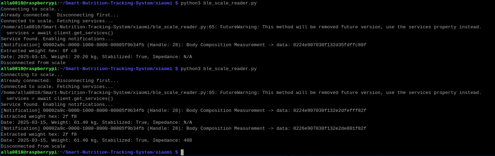

# BLE Device Managers 
This module is to interface between RaspberyPi and the following devices via BLE(Bluetooth Low Energy) to initialize them and to provide real-time data for smart nutrition tracking.  

- [Xiaomi Mi Body Composition Scale 2](https://www.amazon.com/dp/B07VD9F419?ref_=ppx_hzsearch_conn_dt_b_fed_asin_title_2)
- [Decent Espresso Kitchen Scale](https://decentespresso.com/decentscale)

## Installation
1. Install Python (>= 3.7) if not already installed.  
2. Install required dependencies:  
    `sudo pip install bleak --break-system-packages`
3. Clone this repository or copy the script to your working directory.  

## Decent Espresso Kitchen Scale  
After initialized and connected to the Decent Espresso Kitchen Scale, this module listens for real-time food weight data.

Detailed parsing information can be referred to https://decentespresso.com/decentscale_api

## Xiaomi Mi Body Composition Scale 2  
After initialized and connected to the Xiaomi Mi Scale via BLE, this module listens for real-time data, and parses key values such as:  
  
* Control Byte  
  Determines whether the measurement is stabilized and whether impedance data is available.

* Weight  
  Extracted from the received data in either kg or lbs.

* Measurement Date  
  Extracted from the data payload.  

* Impedance Value  
  If available, this value is extracted.  

Below is an illustration of how the control byte and weight data are extracted:

After parsing body weight and impedance data, we can calculate the following metrics

* BMI
* Ideal Weight
* Metabolic Age
* Protein Percentage
* LBM coefficient
* BMR
* Fat
* Muscle Mass
* Bone Mass
* Visceral Fat

The calculation is based on [Bioelectrical impedance analysis](https://en.wikipedia.org/wiki/Bioelectrical_impedance_analysis).

## Usage
Run the script using:

`python3 mi_scale_reader.py`  
  
Make sure your scale is turned on and in pairing mode.

## Example
Below is an example of execution  
  

## References
This implementation is based on the following sources:

[Xiaomi Mi Scale Data Format - OpenScale Wiki](https://github.com/oliexdev/openScale/wiki/Xiaomi-Bluetooth-Mi-Scale)

[Web Bluetooth Mi Scale Implementation](https://github.com/limhenry/web-bluetooth-mi-scale/blob/master/main.js)

## License
This project is open-source and free to use under the MIT License.
  
## Author
* KyoSook Shin (kyosook2@illinois.edu)