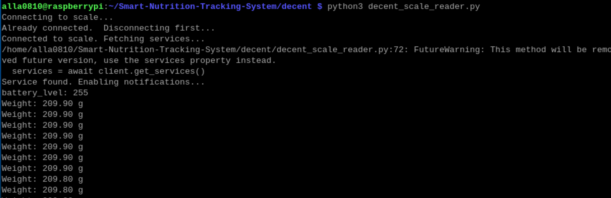

# Decent Scale Data Reader via Bluetooth Low Energy
This project reads and parses weight data from a [Decent Scale](https://decentespresso.com/decentscale) using Python and the `bleak` library.  
  
## Installation
1. Install Python (>= 3.7) if not already installed.  
2. Install required dependencies:  
    `sudo pip install bleak --break-system-packages`
3. Clone this repository or copy the script to your working directory.  
  
  
## How It Works  
The script connects to the Xiaomi Mi Scale via Bluetooth, listens for weight data, and parses weight information  

## Data Parsing Explanation
Detailed parsing information can be referred to https://decentespresso.com/decentscale_api

## Usage
Run the script using:

`python3 decent_scale_reader.py`  
  
Make sure your scale is turned on and in pairing mode.

## Example

Below is an example of execution

## References
This implementation is based on the following sources:

[pydecentscale](https://github.com/lucapinello/pydecentscale)

## License
This project is open-source and free to use under the MIT License.
  
## Author
* KyoSook Shin (kyosook2@illinois.edu)

