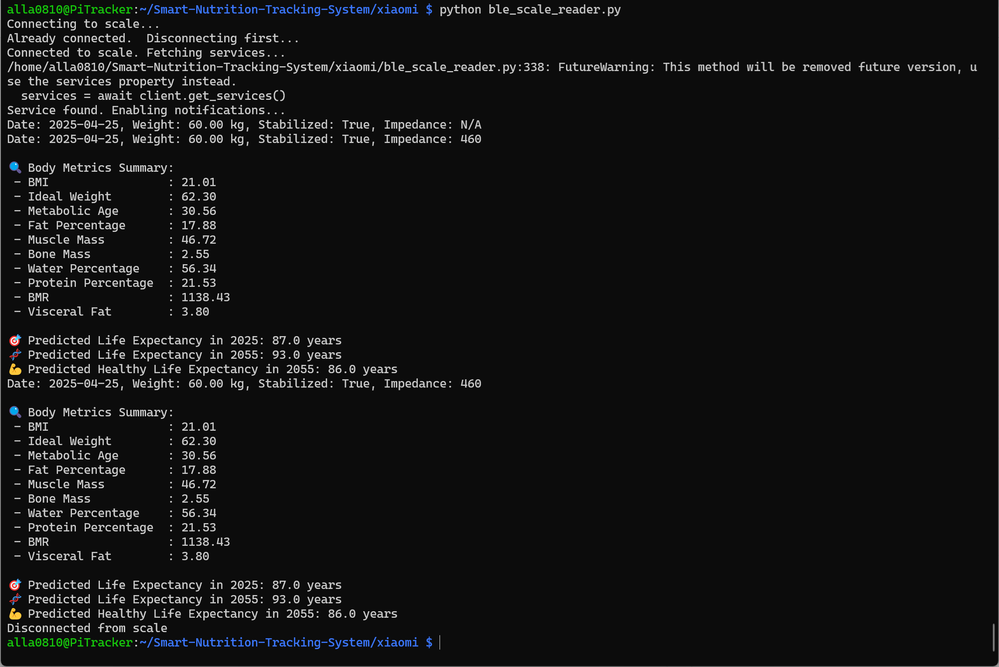
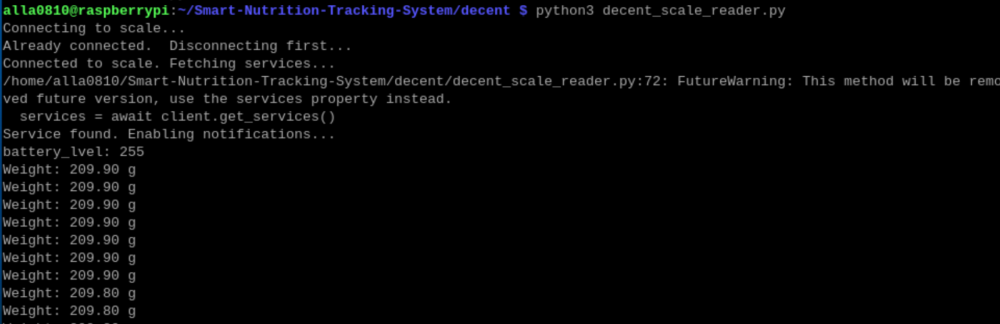

# Xiaomi Mi Scale Data Reader via Bluetooth Low Energy 
This project reads and parses weight data from a [Xiaomi Bluetooth Mi Scale](https://www.amazon.com/dp/B07VD9F419?ref_=ppx_hzsearch_conn_dt_b_fed_asin_title_2) using Python and the `bleak` library.  
  
## Installation
1. Install Python (>= 3.7) if not already installed.  
2. Install required dependencies:  
    `sudo pip install bleak --break-system-packages`
3. Clone this repository or copy the script to your working directory.  
  
  
## How It Works  
The script connects to the Xiaomi Mi Scale via Bluetooth, listens for weight data, and parses key values such as:  
  
* Control Byte  
  Determines whether the measurement is stabilized and whether impedance data is available.

* Weight  
  Extracted from the received data in either kg or lbs.

* Measurement Date  
  Extracted from the data payload.  

* Impedance Value  
  If available, this value is extracted.  

## Data Parsing Explanation
Below is an illustration of how the control byte and weight data are extracted:

## Usage
Run the script using:

`python3 mi_scale_reader.py`  
  
Make sure your scale is turned on and in pairing mode.

## Example
Below is an example of execution  
  

## Researches

Visceral Fat calculation is based on the following research:  
- [Estimating Visceral Fat Area by Multifrequency Bioelectrical Impedance](https://www.researchgate.net/publication/366218564_Dual-Frequency_Bioelectrical_Impedance_Analysis_is_Accurate_and_Reliable_to_Determine_Lean_Muscle_Mass_in_The_Elderly)

Life expectancy estimation algorithm is based on the following researches
- [Edcation and Income Gradients in Logevity](https://www.ncbi.nlm.nih.gov/pmc/articles/PMC10659761)
- [Estimating Healty Life Expectancy Using Body Composition Parameters](https://www.ncbi.nlm.nih.gov/pmc/articles/PMC5418561)
- [Machine Learning Method for Life Expectancy Prediction](https://www.researchgate.net/publication/378874579)

## References
This implementation is based on the following sources:

- [Xiaomi Mi Scale Data Format - OpenScale Wiki](https://github.com/oliexdev/openScale/wiki/Xiaomi-Bluetooth-Mi-Scale)

- [Web Bluetooth Mi Scale Implementation](https://github.com/limhenry/web-bluetooth-mi-scale/blob/master/main.js)

# Decent Scale Data Reader via Bluetooth Low Energy
This project reads and parses weight data from a [Decent Scale](https://decentespresso.com/decentscale) using Python and the `bleak` library.  
  
## Installation
1. Install Python (>= 3.7) if not already installed.  
2. Install required dependencies:  
    `sudo pip install bleak --break-system-packages`
3. Clone this repository or copy the script to your working directory.  
  
  
## How It Works  
The script connects to the Xiaomi Mi Scale via Bluetooth, listens for weight data, and parses weight information  

## Data Parsing Explanation
Detailed parsing information can be referred to https://decentespresso.com/decentscale_api

## Usage
Run the script using:

`python3 decent_scale_reader.py`  
  
Make sure your scale is turned on and in pairing mode.

## Example

Below is an example of execution

## References
This implementation is based on the following sources:

- [pydecentscale](https://github.com/lucapinello/pydecentscale)

## License
This project is open-source and free to use under the MIT License.
  
## Author
* KyoSook Shin (kyosook2@illinois.edu)

